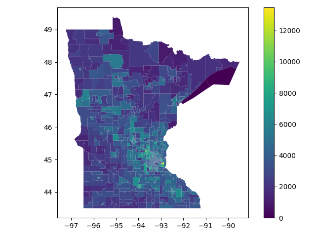

# Political Districting

This library is intended to provide several means of generating political districts from census data, such as weighted k-means clustering and [markov chain methods](https://people.csail.mit.edu/ddeford/MCMC_Intro_plus.pdf).


## Data
This project will primarily make use of data pulled from US Census Bureau for generating political districts in the United States, but will be designed with flexibility to extend to other countries for those interested.

The US Census data is accessed using the [census](https://github.com/datamade/census) library, which acts as a wrapper for the Census Bureau's api and contains data down to the block group level. Those wishing to use it will need an [api key](api.census.gov/data/key_signup.html).

Currently, there are three main functions for retrieving data at various geometric levels that can be accessed in [/data/us_census.py](gerry/data/us_census.py). These include
```python
get_block_groups(survey, state, fields, year, redownload, save)

get_counties(survey, state, fields, year, redownload, save)

get_tracts(survey, state, fields, year, redownload, save)
```
which return a [GeoDataFrame](https://geopandas.org/en/stable/) containing the attribute information for the selected fields in the indicated survey as well as the [shapefile](https://www.census.gov/geographies/mapping-files/time-series/geo/tiger-line-file.2020.html) information for the geographical units.

An example usage is the following, where we extract the population data at the census tract level for Minnesota based on the [2020 Census](https://www.census.gov/data/developers/data-sets/decennial-census.html)
```python
import matplotlib.pyplot as plt
from census import Census
from gerry.data.us_census import get_tracts

api_key = open("census_api_key.txt").readline()    # Path to api_key
field = 'P1_001N'                   # Total population
gdf = get_tracts(
    survey = Census(api_key).pl,    # Redistricting survey
    state = 'MN',
    fields = field,
)

fig, ax = plt.subplots()
gdf.plot(column=field, ax=ax, legend=True)
fig.show()
```
where the [api key](api.census.gov/data/key_signup.html) is stored in the file "census_api_key.txt". This code block produces the following image:


